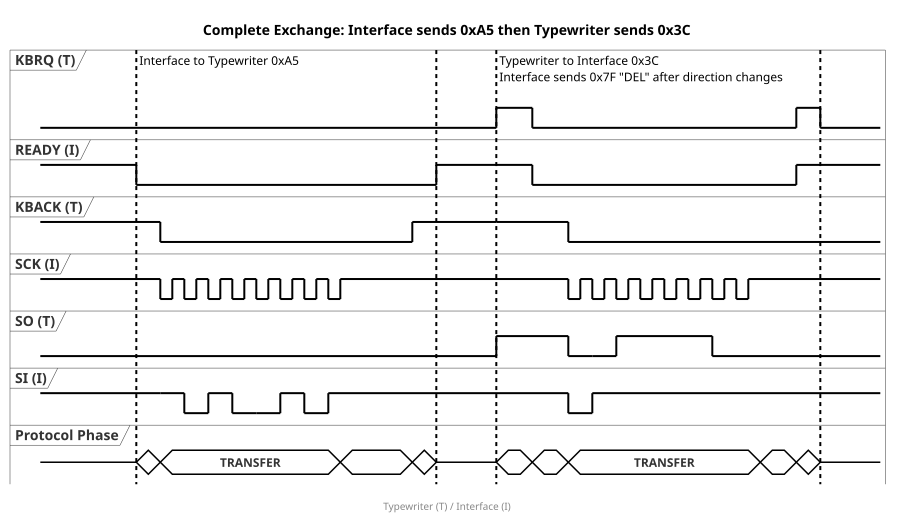
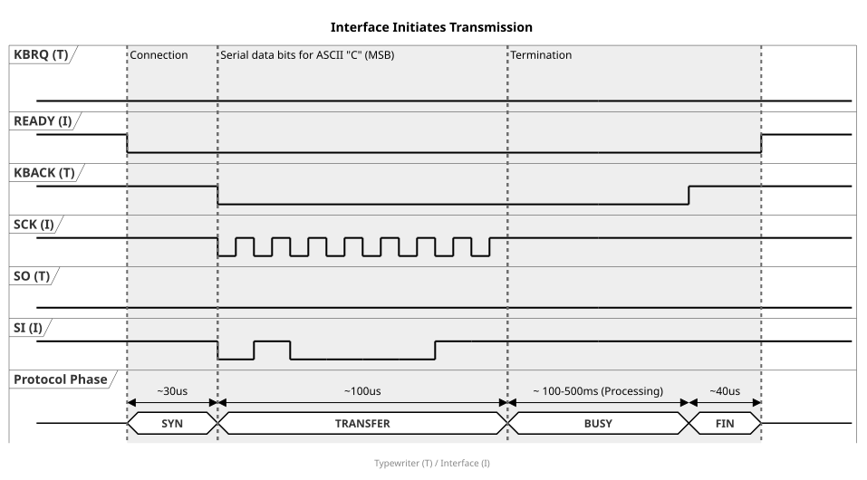
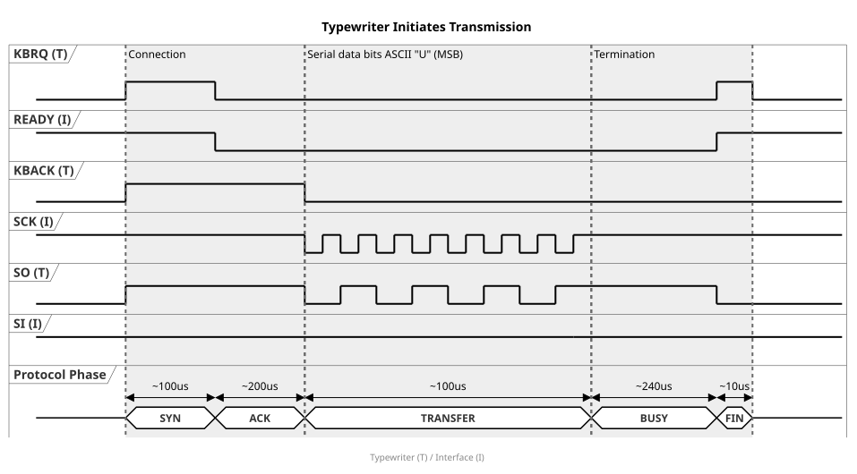

# Protocol Specification — Brother Serial Interface System

A dense, self-contained reference for the proprietary bus protocol used between the
Brother IF-60 interface and compatible electronic typewriters. Derived from black-box
signal analysis of a single IF-60 unit; no official Brother documentation of the bus
protocol exists.

---

## Signal Layer

The bus uses six signals on a 12-pin proprietary connector, all at 5 V TTL levels.

### Connector Pinout

| Pin | Signal | Idle Voltage |
|-----|--------|-------------|
| 1   | GND (reference) | — |
| 2   | +5 V (typewriter supply) | +5 V |
| 3   | SI (Serial In — to typewriter) | last bit sent |
| 4   | SO (Serial Out — from typewriter) | LOW |
| 5   | SCK (Serial Clock) | HIGH |
| 6   | GND | — |
| 7   | KBACK (Keyboard Acknowledge) | depends on last transfer |
| 8   | READY | HIGH |
| 9   | KBRQ (Keyboard Request) | LOW |
| 10  | GND (frame ground) | — |
| 11  | +30 V (typewriter motor supply) | +30 V |
| 12  | +30 V (typewriter motor supply) | +30 V |

### Signal Functions

| Signal | Driver | Idle State | Function |
|--------|--------|------------|----------|
| SCK | Interface | HIGH | Serial clock, always driven by the interface |
| SI | Interface | Last bit sent | Serial data to typewriter |
| SO | Typewriter | LOW | Serial data from typewriter |
| READY | Interface | HIGH | Directly wired to KBRQ inside typewriter; LOW masks KBRQ regardless of typewriter state |
| KBRQ | Typewriter | LOW | Keyboard Request — typewriter pulls HIGH to request a send slot |
| KBACK | Typewriter (reset only) | HIGH after SI, LOW after SO | Flip-flop: first falling SCK edge drives it LOW; only the typewriter can reset it HIGH |

**READY–KBRQ gate:** KBRQ is pulled HIGH by an internal resistor in the typewriter.
Inside the typewriter, READY is wired directly to the KBRQ line. KBRQ can only be HIGH
when READY is HIGH *and* the typewriter is not pulling it LOW. When the interface pulls
READY LOW, KBRQ is forced LOW regardless of the typewriter's state.

**KBACK flip-flop:** The first falling edge of SCK during any transfer forces KBACK LOW.
Only the typewriter can reset KBACK HIGH (signalling that it has finished processing).
After an SI-path transfer, KBACK idles HIGH (typewriter resets it when ready for the next
byte). After an SO-path transfer, KBACK stays LOW (no processing acknowledgement needed).
The idle state of KBACK therefore encodes the last transfer direction.

---

## Transmission Layer

All transfers are initiated by the interface. Data is clocked MSB-first at ≈78 kHz.



### SI Path (Interface → Typewriter)



| Phase | Description |
|-------|-------------|
| **SYN** | Interface pulls READY LOW, waits ≈30 µs |
| **TRANSFER** | 8 bits clocked MSB-first. Data set on falling SCK edge, sampled on rising edge. First falling edge forces KBACK LOW. |
| **BUSY** | Interface waits for KBACK HIGH (typewriter reset). Typical: 100–250 µs. Up to 500 ms if the typewriter's internal buffer is full. |
| **FIN** | Wait ≈40 µs, then READY HIGH |

### SO Path (Typewriter → Interface)



| Phase | Description |
|-------|-------------|
| **SYN** | Typewriter pulls KBRQ HIGH, pre-loads SO HIGH, resets KBACK HIGH |
| **ACK** | Interface pulls READY LOW (≈100 µs after KBRQ↑), which forces KBRQ LOW |
| **TRANSFER** | Interface clocks 8 bits from SO, MSB-first. First falling edge forces KBACK LOW. |
| **BUSY** | Typewriter returns SO LOW. Interface waits ≈240 µs. |
| **FIN** | Interface pulls READY HIGH. KBRQ briefly follows READY then returns LOW. |

### SI During SO Transfers (DEL State Machine)

When the transfer direction changes from SI to SO, the interface sends DEL (0x7F) on SI
during the SO clock cycle. On consecutive SO transfers, SI stays HIGH (0xFF). The
typewriter ignores SI data during SO transfers.

| Previous Transfer | Current Transfer | SI Line During SO Clock |
|-------------------|-----------------|------------------------|
| SI (interface sent) | SO (typewriter sends) | DEL (0x7F) |
| SO (typewriter sent) | SO (typewriter sends) | 0xFF (HIGH) |
| SO (typewriter sent) | SI (interface sends) | Normal data |

### Clock Parameters

| Parameter | Value |
|-----------|-------|
| Clock frequency | ≈78 kHz |
| Clock idle state | HIGH |
| Bits per transfer | 8 |
| Bit order | MSB-first |
| Data set on | Falling edge |
| Data sampled on | Rising edge |
| SPI mode equivalent | Mode 1 (CPOL=0, CPHA=1) |
| Chip select | None (READY serves as frame signal) |

---

## Protocol Layer

### Power-On Sequence

| Step | Direction | Byte | Description |
|------|-----------|------|-------------|
| 1 | Interface → TW | 0xFE | Power-on initialisation |
| 2 | Typewriter → IF | \<ID\> | Model identification byte (AX-20 = 0x30, CE-650 = 0x6A) |
| 3 | Interface → TW | 0x7F | DEL — direction change acknowledgement (on SI during SO transfer) |

The interface uses the ID byte to select the AX or CX command set for the session.

### SELECT Sequence (AX-20)

| Step | Direction | Byte | Description |
|------|-----------|------|-------------|
| 1 | IF → TW | 0xF9 | Enter online mode (bus-side equivalent of serial DC1) |
| 2 | IF → TW | 0xFD | Keyboard query |
| 3 | TW → IF | \<KB\> | Keyboard switch position: KB1=0x04, KB2=0x24, KB3=0x44 |
| 4 | IF → TW | 0xF4 | Margin reset — carriage return to position 0, disable margins |
| 5 | IF → TW | 0xB1 | Pitch reset to 10 cpi (defensive: known state first) |
| 6 | IF → TW | \<P\> | Set active pitch (0xB1=10 cpi, 0xB2=12 cpi, 0xB3=15 cpi) |
| 7 | IF → TW | \<M\> | Optional: reposition to left margin as `[0x8B, 0x00 × N, (0x8A)]` |

**DESELECT (AX-20):** Single byte 0xF8 (bus-side equivalent of serial DC3). Returns the
typewriter to standalone mode.

The CE-650 variant follows the same pattern but includes additional bytes for vertical
margin reset (0xF2) and VMI context (0xA0).

### Bus Byte Reference

| Byte | Function |
|------|----------|
| 0x00 | Carriage advance — one position at current pitch |
| 0x02 | CR+LF (newline) — carriage return and line feed |
| 0x03 | Backspace — one position backward |
| 0x04 | Correcting backspace — backspace with lift-off tape erase |
| 0x06* | Micro-step: paper backward (up) |
| 0x07* | Micro-step: paper forward (down) |
| 0x20–0x7E | Print daisy-wheel position (petal number), not ASCII |
| 0x7F | DEL — following bus bytes are ignored; also direction-change marker |
| 0x88 | Code-Key pressed — start modifier sequence for extended characters |
| 0x89 | Code-Key released — end modifier sequence |
| 0x8A | Underline ON |
| 0x8B | Underline OFF |
| 0x8C* | Bold ON |
| 0x8D* | Bold OFF / formatting reset |
| 0x8E | Repeat key pressed |
| 0x8F | Repeat key released |
| 0x9E | Carriage return (CR) to physical left edge (column 0) |
| 0x9F | Line feed (LF) |
| 0xA0* | Set VMI to 9 (1/6 inch line spacing) |
| 0xA1* | Set VMI to 13 (1/4 inch, default) |
| 0xA2* | Set VMI to 17 (1/3 inch) |
| 0xA3* | Set VMI to 25 (1/2 inch) |
| 0xB1 | Set pitch: 10 cpi (HMI=13) |
| 0xB2 | Set pitch: 12 cpi (HMI=11) |
| 0xB3 | Set pitch: 15 cpi (HMI=9) |
| 0xF2* | Possible vertical margin return |
| 0xF4 | Horizontal margin return (part of SELECT/reset sequences) |
| 0xF5 | Acoustic signal (BEL) — ≈2 seconds |
| 0xF8 | DESELECT — typewriter offline |
| 0xF9 | SELECT — typewriter online |
| 0xFD | Keyboard query (keyboard selection query) |
| 0xFE | Power-on initialisation / model query |

\* CE-650 only. Not used with AX-20.

### CR/LF Translation

Every carriage return on the bus is followed by the active pitch byte \<P\> and, if a left
margin is set, a repositioning sequence \<M\> = `[0x8B, 0x00 × N, (0x8A)]`.

| Serial Input | Bus Output | Note |
|-------------|-----------|------|
| **Auto-LF OFF** | | |
| CR+LF | 0x02, \<P\>, \<M\> | Both bytes consumed, combined newline |
| CR alone | 0x9E, \<P\>, \<M\> | Pure carriage return, no line advance |
| LF alone | 0x9F | Vertical advance only, no carriage return |
| **Auto-LF ON** | | |
| CR+LF | 0x02, \<P\>, \<M\> | LF swallowed to prevent double advance |
| CR alone | 0x02, \<P\>, \<M\> | CR automatically coalesced with LF |
| LF alone | 0x02, \<P\>, \<M\> | LF automatically coalesced with CR |

### Character Encoding

Bytes 0x20–0x7E are daisy-wheel petal positions, **not ASCII**. The mapping between ASCII
codes and petal numbers depends on the keyboard switch position read during SELECT:

- **KB1** — German QWERTZ layout (Y/Z swapped), ISO 646 regional variant
- **KB2** — International Reference Alphabet (ISO 646 IRV)
- **KB3** — Symbol/special character set

The switch position is latched at SELECT time; changing the physical switch without
re-selecting has no effect.

- **Space:** ASCII 0x20 → bus 0x00 (carriage advance), since no petal exists for space
- **Code-Key characters:** `[0x88, <petal>, 0x89]` — simulates the physical Code key
- **Dead keys:** append 0x00 to compensate for the missing carriage advance (e.g. accents)

### Position Tracking

The interface maintains an internal column counter. All horizontal repositioning is
emitted as a sequence of 0x00 (advance) or 0x03 (backspace) steps, bracketed by 0x8B/0x8A
to suppress underline during movement:

```
[0x8B, 0x00 × N, (0x8A)]    — forward N positions
[0x8B, 0x03 × N, (0x8A)]    — backward N positions
```

The trailing 0x8A is only emitted if underline was active before the move.

This pattern is used for:
- Left margin repositioning after CR
- Horizontal tab (HT) expansion
- Absolute horizontal tab (ESC+HT+n)
- Right margin auto-wrap
- ESC+S reset

**Pitch changes** (0xB1–0xB3) are only emitted immediately when the carriage is at
column 1. Otherwise the new pitch is stored internally and emitted at the next CR.

**Right margin auto-wrap:** When a character would exceed the right margin, the interface
automatically inserts a CR+LF before the character. Spaces at the right margin are
discarded. Backspaces at the left margin are ignored.
